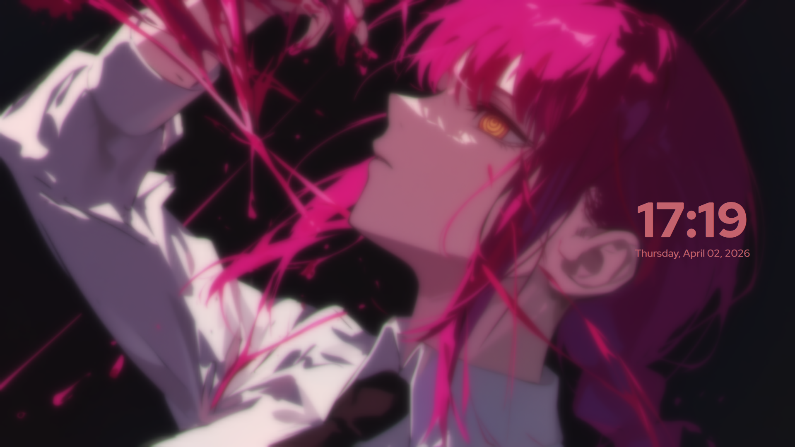

# Makima-SilentSDDM

A Makima (Chainsaw Man) themed configuration for [SilentSDDM](https://github.com/uiriansan/SilentSDDM) - a highly customizable SDDM login manager theme.

Blur with clock:


Password prompt:


## Color Palette (Option C)

| Element | Color |
|---------|-------|
| Accent | `#8B3A3A` (dark rose) |
| Highlight | `#C4626D` (coral pink) |
| Text | `#EFDACC` (cream) |
| Background | `#000000` (pure black) |

## Prerequisites

Requires [SilentSDDM](https://github.com/uiriansan/SilentSDDM) installed.

## Installation

### Option 1: Manual Installation

1. **Download the theme files:**
   ```bash
   git clone https://github.com/YOUR_USERNAME/makima-sddm.git
   cd makima-sddm
   ```

2. **Copy the configuration file to SilentSDDM:**
   ```bash
   sudo cp makima.conf /usr/share/sddm/themes/silent/configs/
   ```

3. **Copy the background image to SilentSDDM:**
   ```bash
   sudo cp makima.png /usr/share/sddm/themes/silent/backgrounds/
   ```

4. **Update SilentSDDM to use this configuration:**
   
   Edit `/usr/share/sddm/themes/silent/metadata.desktop` and change:
   ```
   ConfigFile=configs/default.conf
   ```
   to:
   ```
   ConfigFile=configs/makima.conf
   ```

5. **Restart SDDM:**
   ```bash
   systemctl restart sddm
   ```

## Customization

You can edit `makima.conf` to customize:

- **Background**: Change `background = "makima.png"` to any image in `backgrounds/`
- **Login position**: Change `position = "right"` to `"left"`, `"center"`, or `"right"`
- **Clock position**: Change `position = "center-right"` (options: `top-left`, `top-center`, `top-right`, `center-left`, `center`, `center-right`, `bottom-left`, `bottom-center`, `bottom-right`)
- **Blur intensity**: Change `blur = 32` (0 = no blur, higher = more blur)
- **Colors**: All colors are defined as hex values (e.g., `#C4626D`)

For full customization options, see the [SilentSDDM Wiki](https://github.com/uiriansan/SilentSDDM/wiki).

## System Color Scheme

To apply the Makima colors to your entire desktop (KDE, GTK, Qt), see the companion repositories:

- **KDE Plasma**: Copy `makima.colors` to `~/.local/share/color-schemes/`
- **GTK 3/4**: Copy `colors.css` to `~/.config/gtk-3.0/` and `~/.config/gtk-4.0/`
- **Qt5/6**: Copy `Makima.conf` to `~/.config/qt5ct/colors/` and `~/.config/qt6ct/colors/`

Then restart your session or log out and back in.

## Credits

- **SilentSDDM**: [uiriansan/SilentSDDM](https://github.com/uiriansan/SilentSDDM) - The customizable SDDM theme framework this configuration is made with.
- **Makima-SDDM**: [Arnau029/Makima-SDDM](https://github.com/Arnau029/Makima-SDDM) - The Makima SDDM theme that inspired this configuration (I used the bg image from this).
- **Makima**: Character created by Tatsuki Fujimoto for the manga "Chainsaw Man".
